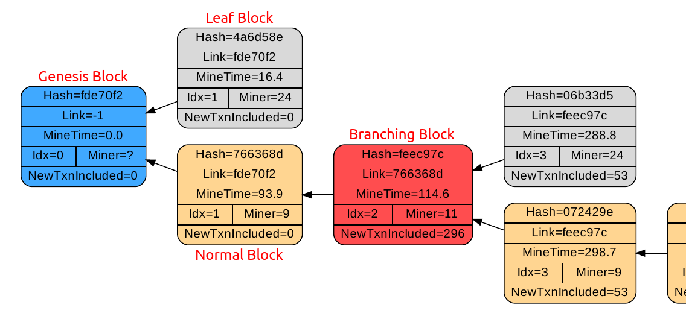
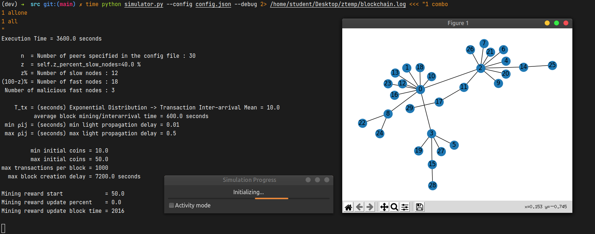
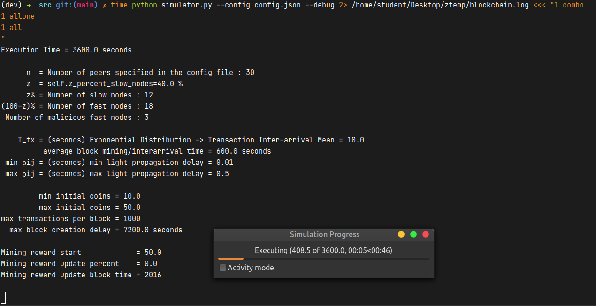

# CS765-Simulate-P2P-CryptoCurrency-Network

- **Subject** - Introduction to Blockchains, Cryptocurrencies and Smart Contracts (CS 765)
- **Semester** - Autumn 2021
- **Project**
  - Build a discrete-event Simulator for a P2P Cryptocurrency Network
    - [Assignment 1 - Problem Statement](./CS765_Autumn2021_Assignment-1.pdf)
  - Simulating a selfish mining attack using the P2P Cryptocurrency Network developed in assignment 1
    - [Assignment 2 - Problem Statement](./CS765_Autumn2021_Assignment-2.pdf)
- **Team Members**
  - 203050054 - Fenil Mehta
  - 203059006 - Aditya Pradhan
  - 20305R005 - Arnab Das
- **Implementation/Solution**
  - [Code](./src)
  - [Project Design Document](./CS765_Project_Design_Document.pdf)
  - [Project Report](./CS765_Project_Report.pdf)
  
## Points to Note

- `Node == Peer == Miner` all three mean the same
- `txn == transaction`
- `Unit of time = seconds` for everything
- `md5` hash function is used for speed - Can be updated to use any other hash function
- `GenesisBlock.prev_node_hash = -1`
- `if` a block with `block_index < node.curr_block_index_max` is received, then it is _not dropped_ because:
  1. The received block can become ancestor of a block which forms a longer chain in future
  2. The block creator would not spend their time and computation power in creating and sending a block which does not
     create a longest chain
- `Transactions` created are always assumed to be authentic in this simulation
  - In the real world, they are signed by the transaction creators (i.e. money senders)
- `mining reward` is always the first transaction of any block, and sender is `-1` only
  - `Sender == -1` means money is created from thin air
  - If mining reward transaction is placed at any position other than index 0, then it is invalid
  - If id_sender for mining reward transaction is anything other than `-1`, then it is invalid
- `mining_reward_update_percent` is used as follows: `new_reward = old_reward (1 + mining_reward_update_percent / 100)`
  - The above statement will be executed every `mining_reward_update_block_time` blocks
    - i.e. when `longest_chain.index % mining_reward_update_block_time == 0`
- Empty blocks are valid
  - Sometimes bitcoin and ethereum have empty blocks
- Any valid transaction created should enter the blockchain even if forks happen
  - We find the common ansestor between the tails of the fork with the help of `block index`
- `Simple Cache` is implemented to optimize block validation and creation
- It is assumed that no one will create time pass transactions where sender and receiver are the same
- Clarifications specific to Assignment 2
  - The attacker is a single node
  - In case of more than one attacker nodes, they all will perform attack individually. They do *NOT* coordinate with
    each other and are unaware of the existence of other attackers
  - Each attacker assumes that all other people are honest (this assumption is not used by the attacker in any part of
    the attacking logic)
  - The attacker does not forward blocks generated/mined by other nodes

## Execution Steps and Images

```shell
cd src
python simulator.py --config config.json --debug
```

[Sample Execution Output](./resources/SampleExecution_3600seconds.zip)




## References

- [Bitcoin and cryptocurrency mining explained](https://www.youtube.com/watch?v=kZXXDp0_R-w)
- [Proof-of-Stake (vs proof-of-work)](https://www.youtube.com/watch?v=M3EFi_POhps)
- [But how does bitcoin actually work?](https://www.youtube.com/watch?v=bBC-nXj3Ng4)
- [Graphviz Visualization](https://graphviz.org/Gallery/directed/fsm.html)
- Exponential Distribution
  - [https://numpy.org/doc/stable/reference/random/generated/numpy.random.exponential.html](https://numpy.org/doc/stable/reference/random/generated/numpy.random.exponential.html)
  - [https://en.wikipedia.org/wiki/Exponential_distribution](https://en.wikipedia.org/wiki/Exponential_distribution)
- Python specific features
  - [Making a python user-defined class sortable, hashable](https://stackoverflow.com/questions/7152497/making-a-python-user-defined-class-sortable-hashable)
  - [Static Typing in Python](https://towardsdatascience.com/static-typing-in-python-55aa6dfe61b4)
  - [https://stackoverflow.com/questions/39740632/python-type-hinting-without-cyclic-imports](https://stackoverflow.com/questions/39740632/python-type-hinting-without-cyclic-imports)
  - [How does a Python set([]) check if two objects are equal?](https://stackoverflow.com/questions/3942303/how-does-a-python-set-check-if-two-objects-are-equal-what-methods-does-an-o)
- KiloByte (kB) vs. KibiByte (KiB)
  - [https://en.wikipedia.org/wiki/Byte#Multiple-byte_units](https://en.wikipedia.org/wiki/Byte#Multiple-byte_units)